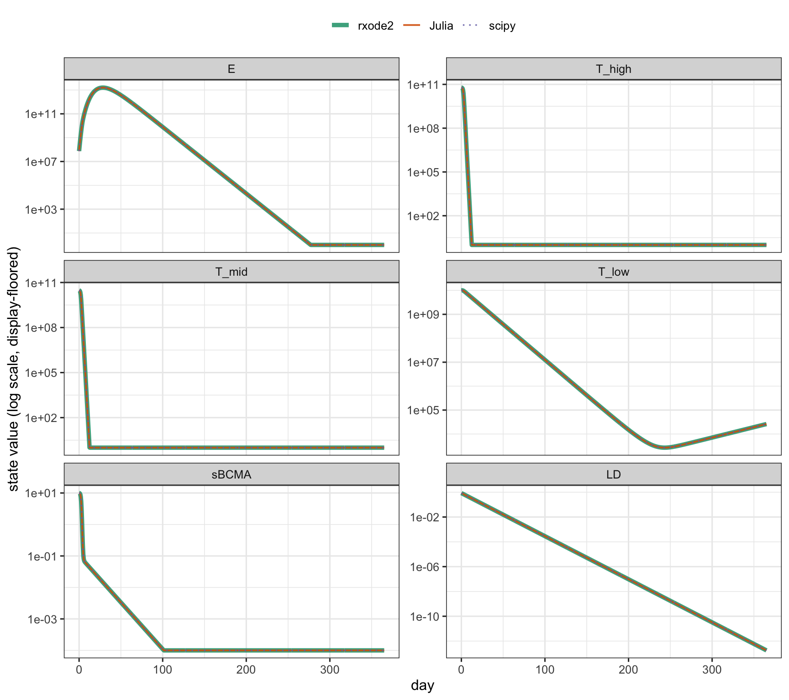
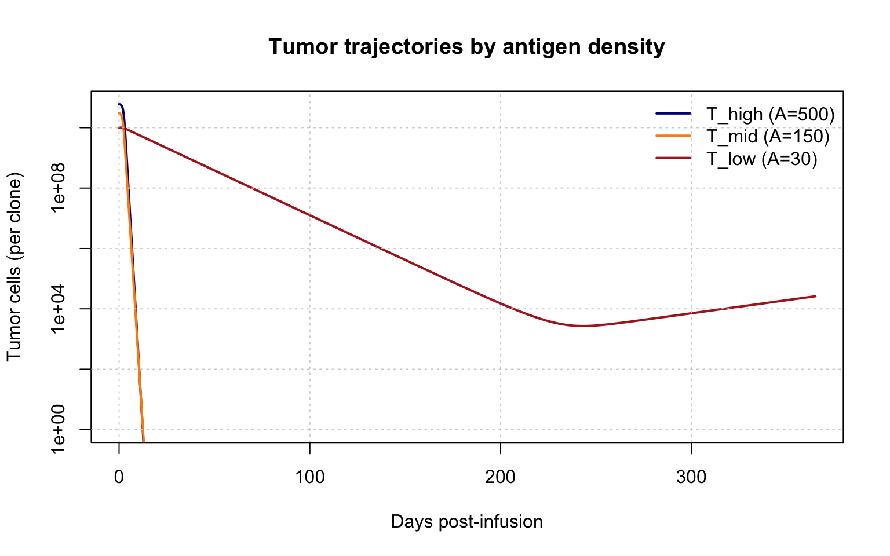
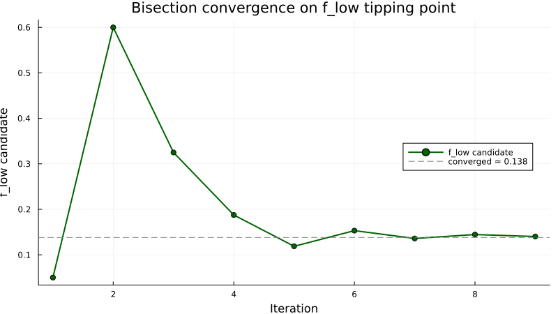
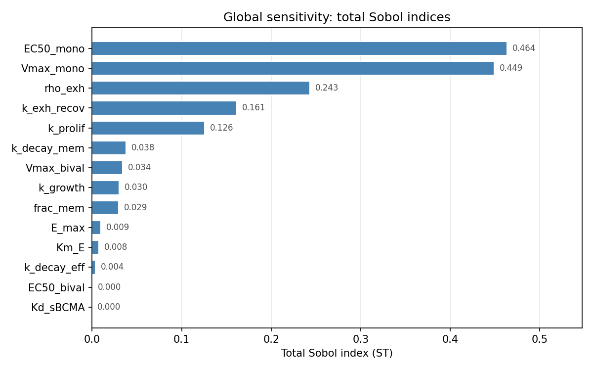

# CAR-T-BCMA-QSP

**Mechanistic QSP of BCMA-directed CAR-T in multiple myeloma** — antigen-escape dynamics, a cross-validated R ↔ Julia implementation, identifiability and global sensitivity analysis, and an nlmixr2 population model.

---

## Overview

BCMA-directed CAR-T drives deep responses in multiple myeloma, but relapse is common — frequently from outgrowth of tumor expressing *low* BCMA antigen density, which the therapy engages weakly. This is a mechanistic systems-pharmacology model of that process: a six-state ODE system tracking CAR-T effectors, a BCMA-stratified tumor, soluble BCMA, and the lymphodepletion niche, built to ask **when the antigen-low compartment escapes control**.

The model is implemented independently in two ecosystems and **cross-validated to machine precision** (R / `rxode2` ↔ Julia / `DifferentialEquations.jl`, with a third `scipy` solve as a neutral anchor). A parallel Julia track explores an alternative contraction mechanism — T-cell exhaustion — and the structural-identifiability and tipping-point questions that come with it.

## The mechanism

The model captures four ideas, all visible in the [full equations](model-specification.md):

- **A BCMA-stratified tumor.** Three clones (high / mid / low antigen density) killed at different rates, so the low-antigen clone is the natural escape route.
- **A two-tier saturable kill.** Antigen density sets a per-cell kill *ceiling* (a Hill function in antigen, bivalent for high/mid and monovalent for low); the effector-to-target ratio sets *approach* to that ceiling (a second Hill in E:T, half-saturating at `ET50`). These are separable saturable processes — not a single bimolecular step — which is what keeps the kill bounded and the system numerically well-behaved.
- **Soluble BCMA as a competitive decoy**, reducing effective effector engagement.
- **A lymphodepletion niche** that opens expansion early and closes as it recovers, producing the characteristic CAR-T expand-then-contract curve.

## Headline results

**Cross-ecosystem validation.** The six-state model, transcribed independently into `rxode2` and `DifferentialEquations.jl` and run on a matched harness, agrees to a maximum *scaled* trajectory error of **2.2 × 10⁻⁶ over 365 days** — ~45× inside the 10⁻⁴ acceptance bar — with the `scipy` anchor corroborating both to ≤ 1.8 × 10⁻⁵. Same model, three independent solvers, one trajectory.

**Antigen-low escape.** Under a representative dose the high- and mid-antigen clones are cleared to a deep nadir, while the low-antigen clone persists and regrows — the model's mechanistic correlate of antigen-low relapse.

**Structural identifiability (exhaustion track).** An AD-guided sensitivity sweep exposed an exact β/X₀ degeneracy — two parameters with equal-and-opposite local sensitivities that a simulation-only check would miss — resolved by reparameterizing to a single identifiable ρ = β/X₀.

**Tipping point (exhaustion track).** A bisection search located the antigen-low tumor fraction threshold, *f*_low\* ≈ 0.138, separating durable control from escape.

## Validation & sensitivity

The R track runs a layered pre-fit pipeline — numerical correctness, mechanistic sanity, local sensitivity (log-log elasticities on a moderate-response baseline), and robustness across baselines. It flags nine unidentifiable parameter pairs and three structural collinearities, each resolved by fixing one member (memory fraction, monovalent Hill coefficient, niche-recovery rate); 13 of 16 parameters hold their sensitivity tier across baselines. The Julia track adds AD-exact local sensitivities and variance-based global (Sobol) indices.

Rendered reports (code hidden) — **canonical 6-state model:** [validation](https://tjmb03.github.io/CAR-T-BCMA-QSP/validation.html) · [sensitivity](https://tjmb03.github.io/CAR-T-BCMA-QSP/sensitivity.html) · [robustness](https://tjmb03.github.io/CAR-T-BCMA-QSP/robustness.html) · [cross-validation](https://tjmb03.github.io/CAR-T-BCMA-QSP/cross-validation.html); **8-state exhaustion track:** [part 1](https://tjmb03.github.io/CAR-T-BCMA-QSP/julia-analysis.html) · [part 2](https://tjmb03.github.io/CAR-T-BCMA-QSP/julia-analysis-part2.html).

## Two mechanistic hypotheses

The expand-then-contract kinetics of CAR-T admit more than one explanation, and this project keeps two distinct ones rather than collapsing them prematurely:

- **Lymphodepletion-recovery** *(the cross-validated canonical model)* — contraction is driven by the host niche closing as lymphodepletion resolves.
- **Exhaustion** *(Julia exploratory)* — contraction is driven by an intrinsic effector-exhaustion state.

These are **different ODE structures, not two encodings of one model**. The cross-validation above is the lymphodepletion-recovery model in two languages; the exhaustion model is a separate hypothesis, carried for the identifiability and threshold analyses. Whether the two are observationally distinguishable from CAR-T kinetics alone is itself an identifiability question the project flags.

## Toward the clinic

A staged `nlmixr2` population model is specified on the canonical structure — four parameters with between-subject variability, four typical-value-only, eleven fixed to literature — as the entry point for fitting clinical CAR-T cohort data toward first-in-human dose selection and exposure–response.

## Methods & stack

- **R** — `rxode2` (forward model, validation, sensitivity), `nlmixr2` (population model), Quarto.
- **Julia** — `DifferentialEquations.jl` (Rodas5P), `ForwardDiff.jl` (AD sensitivity), `GlobalSensitivity.jl` (Sobol).
- **Python** — `scipy` and JAX, as neutral cross-validation anchors.

## Scope

Parameters are **illustrative and literature-anchored, not fitted clinical estimates**; trajectories are mechanistic, not patient predictions. This is a research and methods demonstration, not a clinical decision tool.

## License & citation

Reports, figures, and documentation released under [CC BY 4.0](LICENSE). If you reference this work, see [`CITATION.cff`](CITATION.cff).
